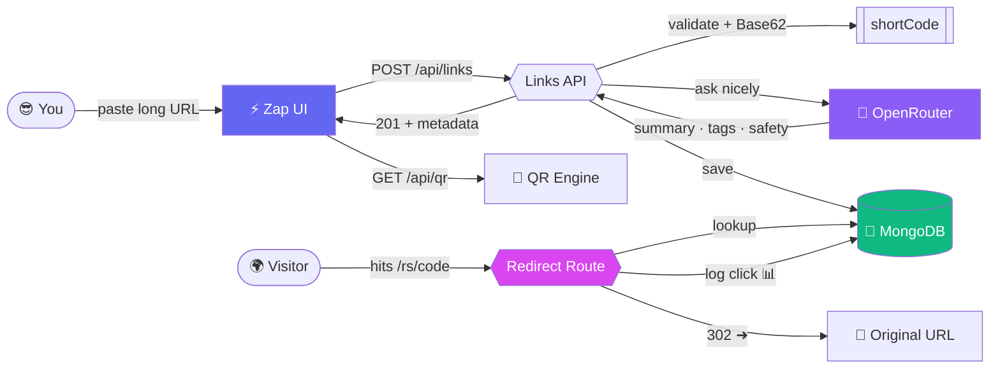
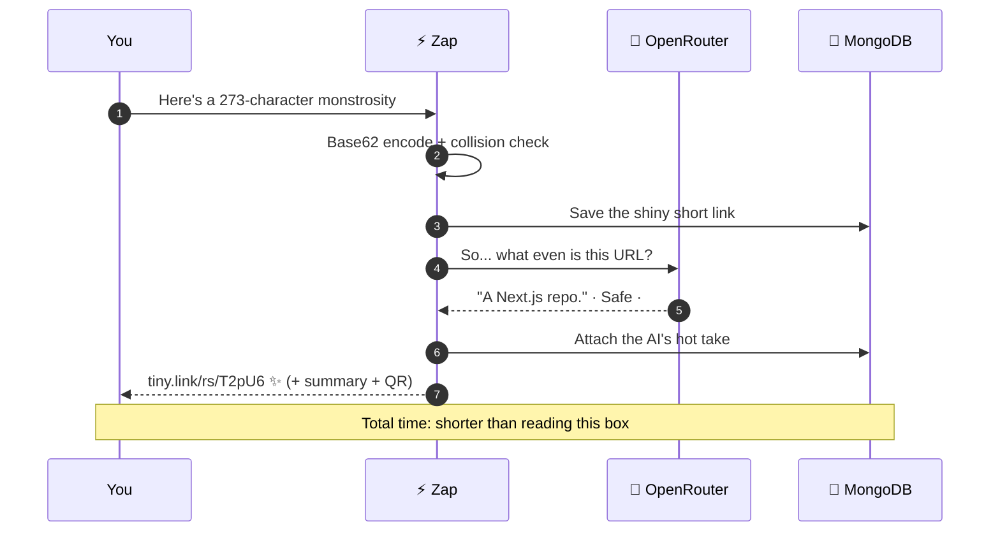

<!-- ════════════════════════════════════════════════════════════════════════ -->
<!--                        ⚡  Z A P   ·   T H E   A I   L I N K   S H O R T E N E R  ⚡                        -->
<!-- ════════════════════════════════════════════════════════════════════════ -->

<div align="center">


<br/>

```
    ███████╗ █████╗ ██████╗     ⚡
    ╚══███╔╝██╔══██╗██╔══██╗    Tiny links.
      ███╔╝ ███████║██████╔╝    Giant brain.
     ███╔╝  ██╔══██║██╔═══╝     Zero chill.
    ███████╗██║  ██║██║
    ╚══════╝╚═╝  ╚═╝╚═╝
```

**Paste an absurdly long URL. Get back a tiny link that _thinks_ —**
**AI summary, safety verdict, click analytics, and a QR code worth framing.**

<br/>


<sub>⭐ If this repo made you smile, the star button is _right there_ and it's very lonely.</sub>

</div>

---

> ### 🎤 The pitch, in one breath
> Every other URL shortener hands you a stubby link and calls it a day.
> **Zap** hands you a stubby link, then quietly reads the destination, writes you a
> one-line summary, decides whether it's sketchy, logs every click, and prints a
> gradient QR code — all before your coffee's gone cold. It's a URL shortener that
> went to grad school. ⚡

---

## 🌌 The Experience

<div align="center">

| Drifting aurora background | Spinning conic glow | Live AI verdict |
| :---: | :---: | :---: |
| 🟣🔵🟢 | 🌀 | 🧠🛡️ |
| Three blurred blobs that never stop moving | A border that orbits your form | Summary + safety, streamed in |

</div>

The whole UI is **dark-native glassmorphism** — frosted panels floating over an animated
aurora, a moving grid, gradient hero type, a pulsing CTA, shimmer-loading skeletons, and
buttery entrance animations. It respects `prefers-reduced-motion`, because chaos should be
_optional_.

---

## ✨ Features (the "wait, it does that?" list)

- ⚡ **Base62 short codes** — compact, URL-safe, with a crypto-random collision-proof fallback.
- 🧠 **AI link metadata** — every link gets a summary, a category, and tags. Automatically. On creation. (OpenRouter · `gpt-4o-mini`)
- 🛡️ **AI safety verdict** — links are tagged **Safe / Flagged / Checking** so you know before you click.
- 📊 **Click analytics** — every visit logs device, referrer, and timestamp. Your links keep a diary.
- 🎨 **Styled QR codes** — gradient, rounded, downloadable PNG — rendered 100% client-side, **zero API keys, zero cost.**
- 🧾 **Standard QR codes** — plain, reliable, base64 on demand.
- 🌙 **A frankly unreasonable UI** — see above. We got carried away. No regrets.
- ⚙️ **Serverless-ready** — cached Mongoose connection that laughs at cold starts and hot reloads.

---

## 🧬 Architecture — the grand tour



---

## 🕹️ The journey of a single link



---

## 🚀 Quick Start (60 seconds, honest)

```bash
# 1 · clone the magic
git clone https://github.com/Rana-Haseeb/link-shortener.git
cd link-shortener

# 2 · install the spells
npm install

# 3 · whisper your secrets
cp .env.example .env.local   # then fill it in (see below)

# 4 · ignite ⚡
npm run dev
```

Now open **[http://localhost:3000](http://localhost:3000)** and paste the ugliest URL you own.

### 🔐 Environment variables

```bash
MONGODB_URI=your_mongodb_connection_string     # 🍃 required — the app's memory
OPENROUTER_API_KEY=your_openrouter_api_key      # 🧠 optional — powers the AI brain
```

> - **`MONGODB_URI`** is the only hard requirement. No DB, no links.
> - **`OPENROUTER_API_KEY`** unlocks summaries + safety. Missing it? Links still work, just quieter.
> - **Styled QR codes need _nothing_.** Rendered in your browser. Free forever. 🎨

---

## 🧭 API Reference

<details>
<summary><b>⚡ <code>POST /api/links</code></b> — mint a short link (with AI enrichment)</summary>

<br/>

**Request**
```json
{ "longUrl": "https://example.com/some/very/long/path" }
```

**Response — `201 Created`**
```json
{
  "id": "65f...",
  "longUrl": "https://example.com/some/very/long/path",
  "shortCode": "T2pU6",
  "securityStatus": "safe",
  "aiMetadata": {
    "summary": "A concise description of the destination.",
    "category": "Software",
    "tags": ["react", "web", "framework"]
  },
  "createdAt": "2026-07-03T12:00:00.000Z"
}
```

| Status | Meaning |
| :----: | :--- |
| `400` | Missing/invalid JSON or a non-http(s) URL |
| `500` | Server / database gremlins |

</details>

<details>
<summary><b>🧾 <code>GET /api/qr?url=&lt;encoded_url&gt;</code></b> — standard QR data URI</summary>

<br/>

**Response — `200 OK`**
```json
{ "url": "http://localhost:3000/rs/T2pU6", "qrCode": "data:image/png;base64,..." }
```
Drop `qrCode` straight into an ``.
The **styled** QR is generated in the browser via `qr-code-styling` — no endpoint needed.

</details>

<details>
<summary><b>🎯 <code>GET /rs/[code]</code></b> — resolve, log, and redirect</summary>

<br/>

Looks up the code, logs a click (device + referrer + timestamp), then **302**-redirects to
the original URL. Unknown codes bounce back to the home page. It's a **302 on purpose** — a
301 gets cached by browsers and your analytics would go blind.

</details>

---

## 🗃️ Data Models

<table>
<tr><th>🔗 Link</th><th>👆 Click</th></tr>
<tr valign="top"><td>

| Field | Type | Notes |
| :--- | :--- | :--- |
| `longUrl` | String | required |
| `shortCode` | String | required · unique |
| `createdAt` | Date | default now |
| `securityStatus` | String | `safe` `flagged` `pending` |
| `aiMetadata` | Object | `{ summary, category, tags[] }` |
| `artisticQrUrl` | String | reserved (future AI-art) |

</td><td>

| Field | Type | Notes |
| :--- | :--- | :--- |
| `linkId` | ObjectId | → `Link` |
| `timestamp` | Date | default now |
| `device` | String | `user-agent` |
| `referrer` | String | `referer` header |

</td></tr>
</table>

---

## 🏗️ Project Structure

```
src/
├── app/
│   ├── layout.js              # 🌌 aurora + grid live here
│   ├── globals.css           # 🎨 the entire animation engine
│   ├── page.js               # ⚡ the show-stopping landing page
│   ├── api/
│   │   ├── links/route.js     # POST — create + AI-enrich
│   │   └── qr/route.js        # GET  — QR data URI
│   └── rs/[code]/route.js     # GET  — redirect + click logging
├── lib/
│   ├── db.js                  # 🍃 cached Mongoose connection
│   ├── ai/metadata.js         # 🧠 OpenRouter summary/tags/safety
│   └── utils/base62.js        # 🔢 encode / decode / random fallback
└── models/
    ├── Link.js                # 🔗 link schema
    └── Click.js               # 👆 analytics schema
```

---

## 🧪 Tech Stack

<div align="center">

| Layer | Weapon of choice |
| :--- | :--- |
| 🖼️ **Framework** | Next.js 16 · App Router · JavaScript |
| ⚛️ **UI** | React 19 + Tailwind CSS 4 + pure-CSS animation sorcery |
| 🍃 **Database** | MongoDB via Mongoose |
| 🧠 **AI** | OpenRouter (`openai/gpt-4o-mini`) |
| 🎨 **QR** | `qrcode` + `qr-code-styling` |
| 🔧 **Config** | `dotenv` · ESLint (`eslint-config-next`) |

</div>

---

## 📜 Scripts

| Command | Does the thing |
| :--- | :--- |
| `npm run dev` | 🔥 dev server with hot reload |
| `npm run build` | 📦 production build |
| `npm run start` | 🚀 serve the build |
| `npm run lint` | 🧹 tidy up |

---

## 🗺️ Roadmap

- [x] Base62 shortening + collision-safe fallback
- [x] Click analytics (device · referrer · timestamp)
- [x] AI summaries, categories & tags
- [x] AI-driven safety status
- [x] Free client-side styled QR codes
- [x] A UI that shouldn't be legal for a link shortener
- [ ] 📈 Analytics dashboard (the clicks are lonely in the DB)
- [ ] 🎨 Optional true AI-art QR (fal.ai / local ControlNet)
- [ ] 🛡️ Real threat-intel scanning (Google Safe Browsing)
- [ ] 🔑 Custom vanity short codes

---

<div align="center">

### ⚡ Shorten boldly. ⚡

Made with an unreasonable amount of `⚡`, a little `🧠`, and zero `😌`.

<sub>If you read this whole README, you're legally required to star the repo. I don't make the rules.</sub>

</div>
